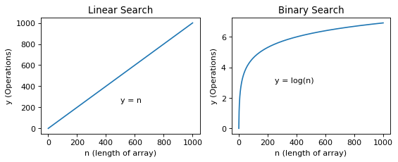

# Table of Contents

1.  [Abstraction](#abstraction)
    1.  [Linear Search](#linear-search)
2.  [Time Complexity Big O](#time-complexity-big-o)
3.  [Decrease and conqeuror paradigm](#decrease-and-conqeuror-paradigm)
    1.  [Binary Search](#binary-search)
    2.  [Implementation](#implementation)
    3.  [Comparisons](#comparisons)
4.  [Divide and conqeuror](#divide-and-conqeuror)
    1.  [Merge sort](#merge-sort)
    2.  [Implementation](#implementation-1)
    3.  [Conclusion](#conclusion)

November 12 2019

This post covers abit of everything that improved my understanding of
computer science and Python. We will go through the following topics to
provide a better understanding of abstraction and cover the underlying
algorithms used to implement these abstractions.

-   Abstraction
-   Big O Time Complexity
-   Decrease and Conqueror with Binary Search
-   Divide and Conqeuror with Merge Sort

# Abstraction

If you&rsquo;re like me, someone from a non tradional STEM background
(Psychology) then you may not notice huge gaps in your knowledge. This
was me before being exposed to data structures and algorithms. Even the
most obvious things did not occur to me because much of it has been
abstracted in an interpreted language such as Python. This means the
lower level implementation is hidden. For example Python&rsquo;s built in list
is written in C where the source code is actually compiled to machine
code.

Lets take another simple example. If you want to search for a number in
a list in Python, what could you do. Probably use a simple for loop or
even Python&rsquo;s &rsquo;in&rsquo; operator.

    array = [2, 3, 3, 7, 9]
    print(7 in array)

    True

While this does provide you with the solution, how does &rsquo;in&rsquo; actually
work? Python had to somehow look for 7 in the array. These are the
abstractions that exist within Python that you do not often see in other
languages.

## Linear Search

The search algorithm could be implemented with a single for loop also
known as linear search. This is because the operations it takes to find
the target value is dependent on stepping to the next pointer N number
of times until the length of the array has been traversed.

    def linearSearch(array, target):
        for i in range(len(array)):
            if array[i] == target:
                return True
        return False

In Python you actually have access to the data itself. The example below
is considered as more Pythonic but both examples do the exact same
thing.

    def linearSearch(array, target):
        for i in array:
            if i == target:
                return True
        return False

In linear search you would expect it to take a long time to find a
target that presents itself at the end of an extremely long array. This
is also known as the naive solution / brute force approach to
a problem, as it is often the most obvious but does not perform well
with lots of data. But this shows the implementation of how the &rsquo;in&rsquo;
operator works, resulting in searching for an item in a list taking n
time (with n being the length of the array).

You can see how this may take a really long time. For example if you
wanted to search for a word at the end of a dictionary, you would have
to go through every single word. However there are data structures that
allow &rsquo;in&rsquo; to work in constant O(1) time such as a hashtable (dictionary
in Python) due to the properties of the data structure. The analogy here
would be looking up the word on google and receiving an instant
response.

As we are working with arrays, how do we come up with a solution better
than linear search.

# Time Complexity Big O

To more formally understand and analyse the time complexity of an
algorithm, we use the worst case scenario which is usually thought about
in very large datasets. This means that constants are dropped as they
are deemed non-meaningful under Big O notation.

For example, we might have a problem whereby we must find the index of
the first character that is not a duplicate in a string e.g. hellohoang
would return 1 for the e element. The solution below to find the index
of the first character that is not a duplicate has 3 for loops making it
take 3n to solve where n is the length of the string.

    def firstUniqChar(s):
        """
        :type s: str
        :rtype: int
        """
    
        # count all the duplicates (key = char, value = appearances)
        # could also just use: dic = collections.Counter(s)
        dic = {}
        for i in s:
            if i not in dic:
              dic[i] = 1
            else:
                dic[i] += 1
        print(dic)
    
        # create a set data structure to get all the unique values
        uniques = set()
        for k, v in dic.items():
            if v == 1:
                uniques.add(k)
        print(uniques)
    
        # return the index of the first unique
        for idx in range(len(s)):
            if s[idx] in uniques: # set is unordered and has as O(1) lookup
                return idx
    
        # can also just directly look up the dictionary
        # for idx in range(len(s)):
        #     if dic[s[idx]] == 1:
        #         print(idx)
    
    print(firstUniqChar("hellohoang"))

    {'a': 1, 'e': 1, 'g': 1, 'h': 2, 'l': 2, 'o': 2, 'n': 1}
    set(['a', 'e', 'g', 'n'])
    1

Despite the 3 for loops, it still has a linear time as only the n in 3n is deemed to be relevant in larger datasets. We will now look at different approaches to design
algorithms that take less time to execute.

# Decrease and conqeuror paradigm

In a decrease and conquer strategy the approach includes:

1.  Decrease or reduce problem instance to smaller instance of the same
    problem and extend solution.
2.  Conquer the problem by solving smaller instance of the problem.

## Binary Search

One of the best known examples of decrease and conqeuror and
consequently this makes it a good searching algorithm is Binary Search.
If you undertake online courses such as Harvard&rsquo;s famous CS50 then you
may be familiar with the alogithm as it is a foundational concept in
introductory classes.

One of the properties of a sorted array of integers is that it allows
for binary search. If an array is not sorted, you can use Python&rsquo;s
array.sort() method which is also an abstraction of sorting algorithms because it hides the implementation of the algorithm (which is discussed further below). Sorted arrays make it easier to
search for a value because we can ignore data that is above or below our
guess of where the data is located.

For example in the array earlier [2, 3, 3, 7, 9], if we were without any
information as to the numbers in the array, we can take a random guess
that 7 is in the middle. 3 is discovered. With the knowledge that the
array is sorted, we can ascertain that 7 will be located on the right
hand side of the middle index as it is greater than 3. This would mean
that any number that is below the middle index could be ignored. This is
the power of binary search. We keep taking random guesses and updating
the span of the array that is within possibility until we find out
whether or not the number exists.

## Implementation

For efficiency we take the middle point as our random guess through the
use of a left and right pointer, these pointers will also be the head
and tail of the array that is being updated based on whether the target
value is above or below the middle point.

    def binarySearch(array, target):
    
        left = 0
        right = len(array) - 1
    
        while left <= right:
            middle = (left + right) // 2
            if target == array[middle]:
                return True
            elif target < array[middle]:
                right = middle - 1
            elif target > array[middle]:
                left = middle + 1
    
        return False

## Comparisons

While our example does not illustrate the efficiency of Binary Search, a
larger array shows Binary Search to be much more efficient, with the
number of operations plateauing as n increases.

*Comparing y = n and y = log(n) with matplotlib*

# Divide and conqeuror

1.  Divide the problem into smaller pieces
2.  Conqueor by building the problem back up again

## Merge sort

Another abstraction within Python as mentioned earlier is the
list.sort() method. If you are familiar with classes than you will
realise that this method is acting on the list object implemented behind the scenes. It
specifically uses an algorithm called Tim Sort which combines the
popular Insertion and Merge sort. Merge sort is a great example of a
divide and conqueror because it subdivides the problem by dividing the
array in half and then merging the halves.

## Implementation

    def mergeSort(array):
      if len(array) == 1:
        return array
    
      middleIdx = len(array)//2
      leftLst = array[:middleIdx]
      rightLst = array[middleIdx:]
      return mergeSortedArrays(mergeSort(leftLst), mergeSort(rightLst))
    
    def mergeSortedArrays(leftLst, rightLst):
      sortedArray = [] # sortedArray = [None] * (len(leftLst) + len(rightLst))
      i = j = 0 # leftIdx, rightIdx
    
      while i < len(leftLst) and j < len(rightLst):
        if leftLst[i] <= rightLst[j]:
          sortedArray.append(leftLst[i])
          i += 1
        else:
          sortedArray.append(rightLst[j])
          j += 1
    
      while i < len(leftLst):
        sortedArray.append(leftLst[i])
        i += 1
    
      while j < len(rightLst):
        sortedArray.append(rightLst[j])
        j += 1
    
      return sortedArray
    
    print(mergeSort([435,7,324,5,76,8,2,9,657278,54]))

    [2, 5, 7, 8, 9, 54, 76, 324, 435, 657278]

The time complexity analysis is O(n log(n)) where n in the input array
because every level in the merge sort takes linear time and every level
is divded by half therefore log of n.

## Conclusion

This post was to help myself in understanding the things that happen under the hood. If you&rsquo;re like me, then you might be fascinated by all the things that are abstracted from view and the different algorithms used to implement things in order to perform quickly.

There can be many layers of abstraction over a program. Object Oriented
Programming is a prime example of this whereby the method&rsquo;s
implementation can be hidden. This will be discussed in a later post.

Til next time.

