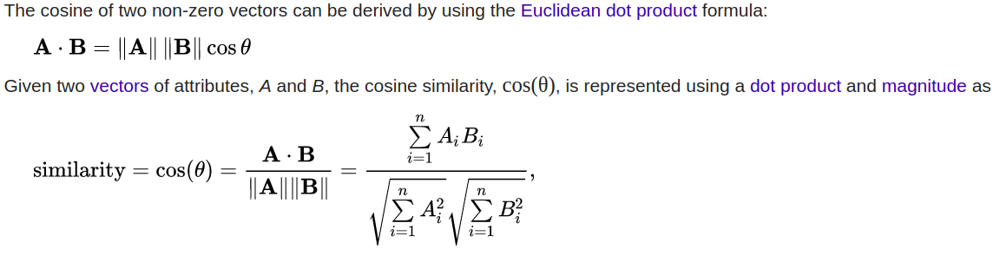

September 7 2019

I have recently become more and more interested in working with text data. Cosine Similarity (cosine distance) is a measure that could be used for calculating how "similar" (hence the name) documents in a corpus are related. It is also a technique used in colloborative filtering for recommendation systems. If we want to calculate how similar text in a document is, how would we go about this? A rather simple method would be to see how the word count of unique words between the documents differ regardless of their order (english sentence can be expressed in a different order but mean similar things). Cosine Similarity attempts to do this. 

The emphasis for this post is on the calculation. This was inspired by the <a href="https://stackoverflow.com/questions/1746501/can-someone-give-an-example-of-cosine-similarity-in-a-very-simple-graphical-wa"> post </a> at Stackoverflow which explains both the calculation and intuition.

## Representing words in a document as an array of numbers 

Lets take the hypothetical example below showing 3 different sentences dicussing a manga I enjoy called One Piece.

> d1. I love the One Piece manga because of the story.  

> d2. I love the story and characters in One Piece.  

> d3. One Piece is the best selling manga.   

Below is the unique words (order does not matter because of the bag of words representation using the 1-gram approach)

> characters the manga is because One selling and story best I love Piece in

As computers do not understand text, we convert the sentences above into vector form so that the cosine of the angle can be calculated (a number represents the appearance of the word in the document)

> d1: [0, 2, 1, 0, 1, 1, 0, 0, 1, 0, 1, 1, 1, 0]  
> d2: [1, 1, 0, 0, 0, 1, 0, 1, 1, 0, 1, 1, 1, 0]  
> d3: [0, 1, 1, 1, 0, 1, 1, 0, 0, 1, 0, 0, 1, 0]

## Cosine similarity 
Now that we have the documents in numeric form, we can follow the formula where the output should be a number between 0 and 1 (where 1 means the documents are exactly the same in similarity) 

 
*Source: https://en.wikipedia.org/wiki/Cosine_similarity*

If we want to see how similar document 3 is to document 1 with cosine similarity:

> DotProd(d1:d3) = 0x1 + 2x1 + 1x1 + 0x1 + 1x0 + 1x1 + 0x1 + 0x0 + 1x0 + 0x1 + 1x0 + 1x0 + 1x1 + 0x0 = 5  

> Magnitude(d1) = sqrt(4 + 1 + 1 + 1 + 1 + 1 + 1 + 1) = sqrt(11)  

> Magnitude(d3) =  sqrt(1 + 1 + 1 + 1 + 1 + 1 + 1) = sqrt(7)  

> Cosine Similarity = 0.569802882

Lets do d3 with the rest of the docs

> d3:d1 = 0.57  
> d3:d2 = 0.4  
> d3:d3 = 1 # cosine similarity shows that there is no difference between the documents

## Further directions
The entity that is being discussed "One Piece" is two different words but can be thought of as one topic therefore increasing the similarity score.
You will also notice that common non-meaningful words like 'the' have the same impact on similairity as other words. We will have a look at how we can use TF-IDF (Term Frequency Inverse Document Frequency) to reflect how important a word is to a document or corpus and how this could be used to normalize the non-meaningful words.
