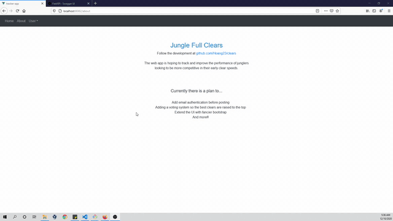

[Github](https://github.com/Hoang23/clears)  

<h2> Technology stack </h2>
FastAPI for endpoints, Vue.js for frontend UI/logic and Axios to make HTTP requests towards the REST API  

<h2> Demo</h2>

